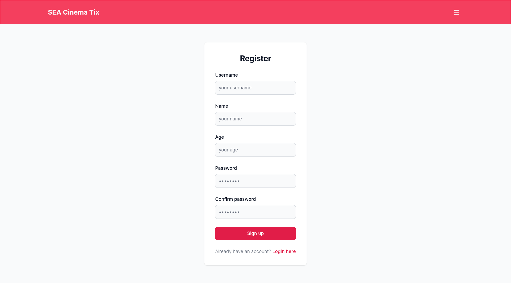
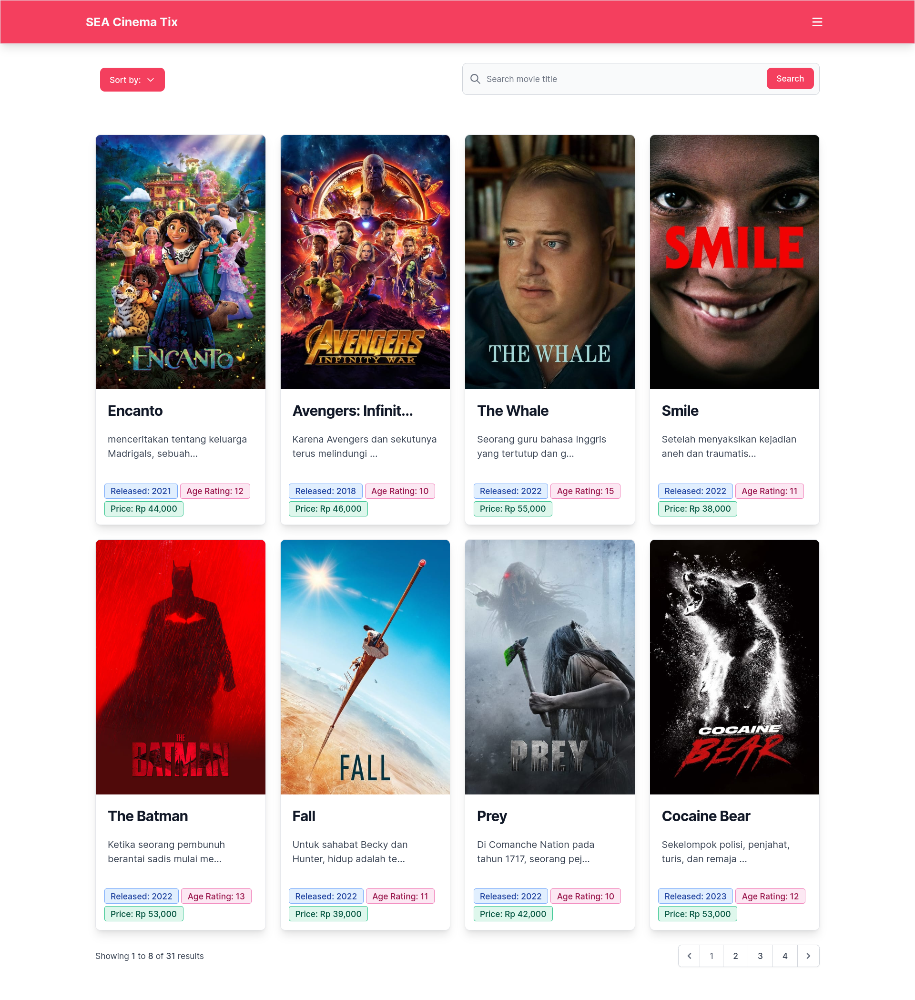
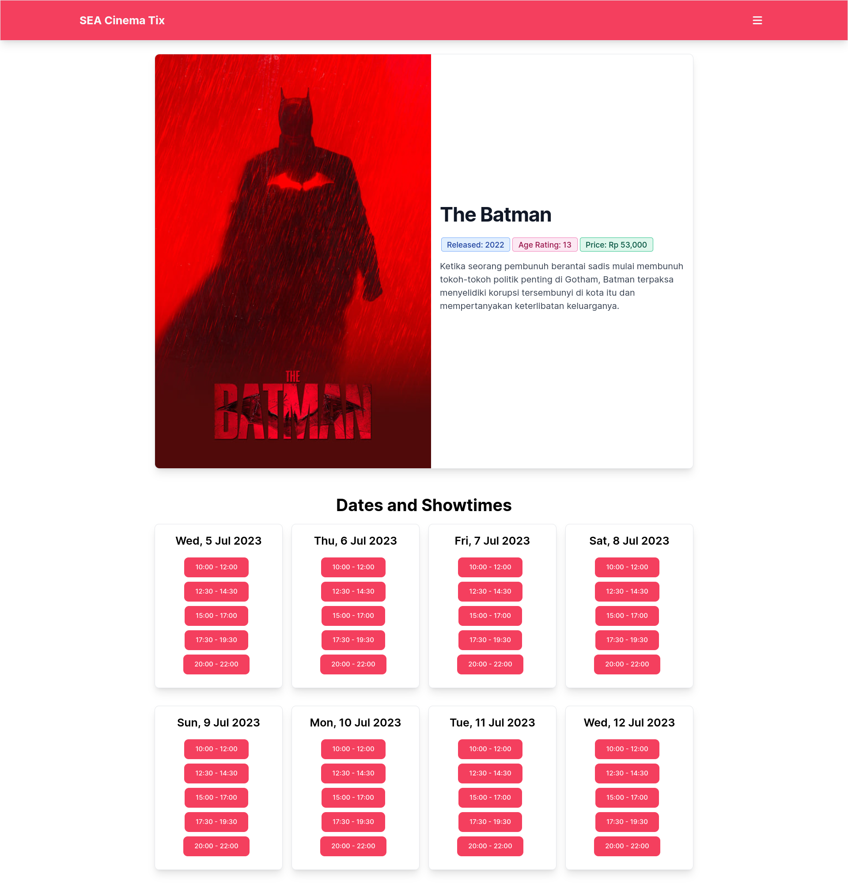
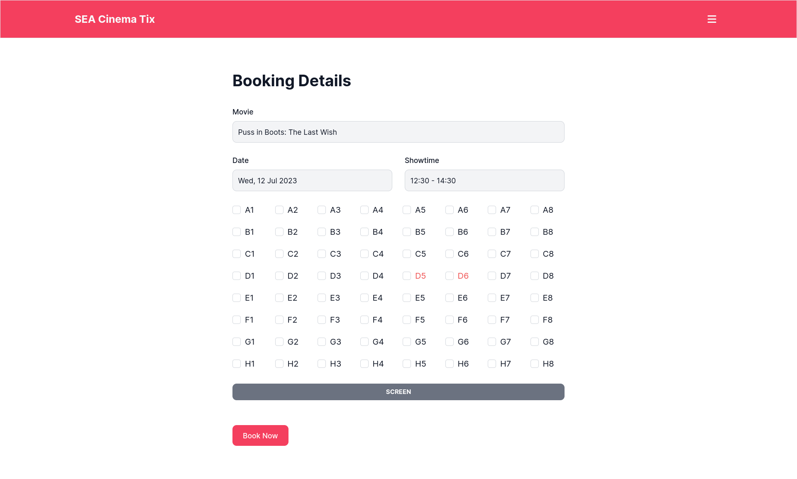
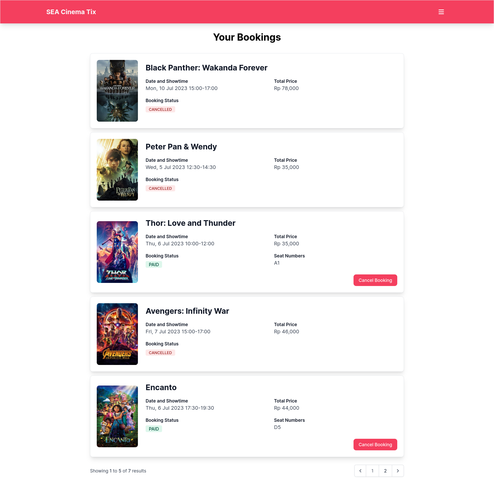
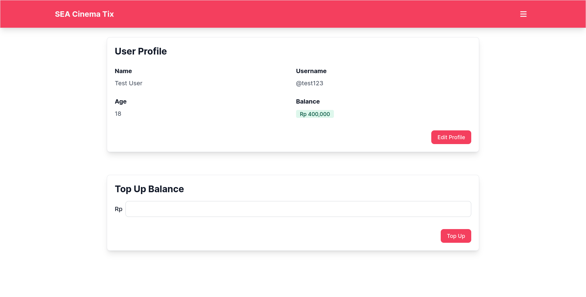
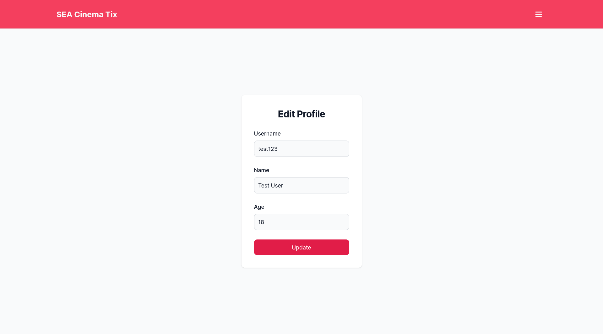

# SEA Cinema Tix

## Description

This is a challenge project for the [Compfest 15](https://compfest.id/) Software Engineering Academy (SEA) program.

The SEA Cinema Tix is a movie ticket booking web application developed to enhance the moviegoing experience for customers of SEA Cinema. Built with Laravel 10 Framework, TailwindCSS, and powered by a MySQL database, this application provides a seamless and efficient platform for users to browse movies, book tickets, and manage their reservations.

## Database Schema

This project uses a MySQL database to store and manage data. Check out the database schema [here](https://dbdocs.io/bagashiz/sea_cinema_tix), powered by [dbdocs.io](https://dbdocs.io/).

## Screenshots

## Contributing

Developers interested in contributing to the SEA Cinema Tix project can refer to the [CONTRIBUTING.md](CONTRIBUTING.md) file for detailed guidelines and instructions on how to contribute.

## License

The SEA Cinema Tix project is licensed under the [MIT License](LICENSE), providing an open and permissive licensing approach for further development and usage.
